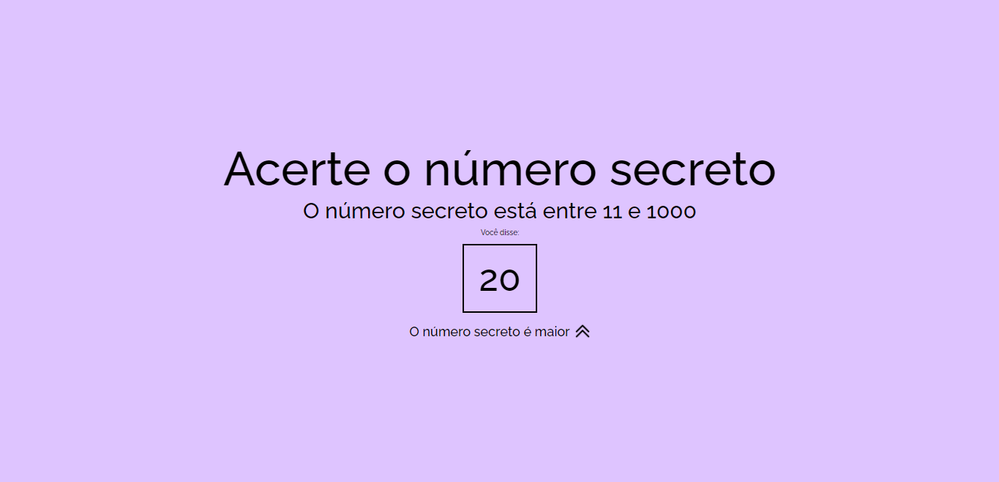

# Alura-ReconhecimentoVoz

This project is a course offered by **Alura** and has **Guilherme Lima** as a instructor:
[Link for the course](https://cursos.alura.com.br/course/javascript-validacoes-reconhecimento-voz)

# Site Preview 

# Project Concept

> This is a Voice Recognizing project that use Web Speech API([MDN doc](https://developer.mozilla.org/en-US/docs/Web/API/Web_Speech_API))
> The idea is to create a game that recognize the number that you said and return if the number is under or above the sorted number
> ALERT: the voice reccognizing is in Brazillian-Portuguese

# Major Knowledges 

- How to implement one API in your project
- How to use Speech API

## My Changes 

Of course you will see some differences between the original code and my code and 
this happens because I implementeded the all the funcionalities by my way 

## That's it, enjoy the Game and find the easter egg :D
